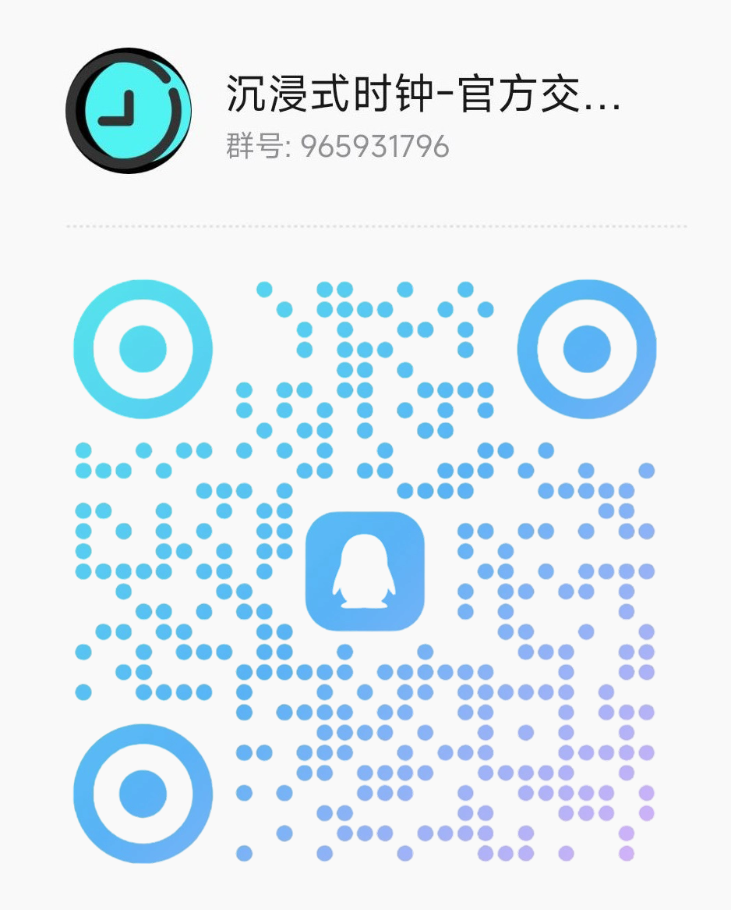

<div align="center">


# Immersive Clock | 沉浸式时钟 ⏰

[](LICENSE)
[](https://react.dev/)
[](https://www.typescriptlang.org/)
[](https://vite.dev/)
[](https://www.electronjs.org/)
[](https://clock.qqhkx.com)
[](https://github.com/QQHKX/immersive-clock/releases)
[](https://deepwiki.com/QQHKX/Immersive-clock)

[🖥️ Live Demo](https://clock.qqhkx.com) | [🇨🇳 简体中文](README.md) ｜ 🇺🇸 English

<pre>
Elegant time management, focused learning
</pre>

</div>

## 📑 Table of Contents

- [Overview](#-overview)
- [Interface Preview](#-interface-preview)
- [Quick Start Guide](#-quick-start-guide)
- [Features](#-features)
- [Usage](#-usage)
- [Accessibility](#-accessibility)
- [Project Structure](#-project-structure)
- [Documentation](#-documentation)
- [FAQ](#-faq)
- [Feedback and Discussion](#-feedback-and-discussion)
- [Contributing and Development](#-contributing-and-development)
- [License and Author](#-license-and-author)
- [Derivative Projects](#-derivative-projects)
- [Friendly Links](#-friendly-links)
- [Star History](#-star-history)

## 🕒 Overview

**Immersive Clock** is a full-screen time dashboard designed for classrooms, study spaces, and
personal focus. It is built with React, TypeScript, and Vite and ships as a Web/PWA application plus
Electron desktop builds.

The app combines Clock, Countdown, Stopwatch, and Study modes with schedules, event countdowns,
weather and location, environmental quietness scoring, multi-channel quotes, and appearance controls.

> Primary scenarios: classroom and study-room projection, exam preparation, focused study,
> presentation dashboards, Pomodoro timing, and desktop clocks.

The product favors local-first data, reversible settings, and honest metrics. Noise monitoring is a
study-environment aid rather than a professional sound level meter. Weather, online quotes, and
network time sources depend on their respective third-party services.

## 🌠 Interface Preview

The interface continues to evolve. To avoid keeping obsolete settings and report screenshots in the
README, this page no longer embeds the retired gallery. Use the [live demo](https://clock.qqhkx.com)
to see the current version.

The main interface includes:

- **Minimal Clock** — large time, date, and an auto-hiding HUD.
- **Countdown and Stopwatch** — suited to lessons, exams, talks, and individual focus.
- **Study Dashboard** — time, weather, noise, schedule progress, events, and quotes.
- **Grouped Settings Center** — Workspace, Visual Appearance, Environment Alerts, Content and Quotes,
  and System Data.
- **Environment Reports** — quietness score, valid coverage, trends, and influence summaries.

See the [screenshot guidelines](docs/marketing/assets/screenshot-guidelines.md) for maintaining current
promotional images.

## 🚀 Quick Start Guide

### 📱 Option 1: Install the PWA (recommended)

The PWA launches from its own icon and keeps the core clock interface and local content available
after the first successful online load.

1. Open the [live app](https://clock.qqhkx.com) in a modern Chrome, Edge, or Safari browser.
2. Use the browser's Install App or Add to Home Screen action.
3. Launch it later from the desktop, Start menu, or home screen.

Weather, online quotes, network time sources, and external feedback still require a connection.

### 🌐 Option 2: Use the browser version

Open [clock.qqhkx.com](https://clock.qqhkx.com) without installing anything. A recent Chrome, Edge, or
Safari version is recommended for PWA, audio, location, and fullscreen capabilities.

### 💻 Option 3: Use an Electron desktop build

Download packages from [GitHub Releases](https://github.com/QQHKX/immersive-clock/releases/latest):

- **Windows**: x64 installer and portable builds.
- **Linux**: AppImage, deb, and rpm builds.
- **macOS**: no native package is currently published; use the Web/PWA version.

## 💡 Features

### 🧭 Time modes

- **Clock**: adjusted current time and date, with an optional seconds display.
- **Countdown**: custom hours, minutes, seconds, presets, pause, resume, reset, and audio cues.
- **Stopwatch**: start, pause, and reset for lessons, activities, and personal timing.
- **Study mode**: a projection-friendly dashboard for long-running display.
- **Immersive HUD**: show it by clicking the page or pressing `Space` / `Enter`; it hides after about
  eight seconds of inactivity.

### 📚 Study organization

- **Schedules**: add, order, validate, and preview-import sessions from Excel files.
- **Event countdowns**: Gaokao targets, one custom event, or an ordered multi-event rotation.
- **Information rotation**: day progress, schedule progress, next session, short-term rain, weather
  alerts, and custom messages.
- **Display controls**: show or hide weather, noise, event, date, and quote components.

### 🌦️ Environment awareness

- **Weather and location**: Xiaomi Weather with high-accuracy location, public-IP fallback, and manual
  city selection.
- **Weather alerts**: current conditions, minutely precipitation, air quality, alerts, sunrise, and
  sunset information.
- **Quietness score**: a relative `0–100` score for comparing the environment on the same device.
- **Estimated dB(A)**: shown only after a 10-second external sound-level reference calibration and not
  presented as certified measurement.
- **History and reports**: valid coverage, score trends, influence summaries, and raw feature archives.

### 🎨 Content and personalization

- **Quote channels**: local content, Hitokoto, Jinrishici, and Advice Slip with weights and fallback.
- **Appearance system**: fonts, colors, backgrounds, and effects at global, page, component, state, and
  event levels.
- **Local resources**: background images and `.ttf`, `.otf`, `.woff`, or `.woff2` fonts.
- **Reduced motion**: follows the operating system preference.

### 💾 Data and platforms

- **Local-first**: no account is required; most settings and user content stay in the current profile.
- **Backup and restore**: full backup, settings-and-assets backup, and separate `.icnoise` archives.
- **Selective cleanup**: cache, history, diagnostics, and unused resources can be cleared separately.
- **PWA and desktop builds**: offline core UI, background updates, and Windows/Linux packages.

## 📘 Usage

### Basic controls

- Click an empty area or press `Space` / `Enter` to show the HUD.
- Use the HUD to switch between Clock, Countdown, Stopwatch, and Study modes.
- The Settings button is in the lower-left corner; the question-mark button on Clock replays onboarding.
- Most settings apply only after selecting Save at the bottom of the panel. Cancel discards the draft.

### Countdown

1. Enter Countdown mode.
2. Click the central time once, or select Set from the HUD.
3. Confirm the duration, then select Start from the HUD.

Confirming the duration does not start the timer. The final five seconds play tick sounds, followed by
an end chime.

### Study mode

- **Workspace (`常用工作台`)**: startup page, Study display, event countdowns, and schedules.
- **Environment Alerts (`环境提醒`)**: noise, weather, and location.
- **Content and Quotes (`内容语录`)**: refresh, display effects, and quote channels.
- **Visual Appearance (`视觉外观`)**: fonts, backgrounds, time, and top information bar.
- **System Data (`系统数据`)**: time calibration, backup, cleanup, and diagnostics.

Read the [English user guide](docs/user-guide/en-us/user-guide.md) for complete instructions. The
quietness model is documented in Chinese in
[Quietness Scoring](docs/technical/modules/quietness-scoring.md).

## ♿ Accessibility

| Input                   | Action                                                 |
| ----------------------- | ------------------------------------------------------ |
| `Space` / `Enter`       | Show the HUD on the main page                          |
| `Escape`                | Close supported dialogs and overlays                   |
| `Tab` / `Shift+Tab`     | Move keyboard focus between interactive controls       |
| Click countdown display | Open countdown duration settings                       |
| Reduced-motion setting  | Reduce quote, overlay, and interface transition motion |

The app uses semantic HTML, ARIA attributes, visible focus, and keyboard interaction, with ongoing
desktop and narrow-screen touch checks.

## 🗂️ Project Structure

```text
immersive-clock/
├── electron/          # Electron main process, preload, IPC, and desktop capabilities
├── public/            # Runtime assets, icons, PWA manifest, announcements, and changelog
├── src/
│  ├── components/     # Clock, HUD, weather, noise, settings, and other domain components
│  ├── contexts/       # Application and appearance state
│  ├── hooks/          # Timer, audio, fullscreen, and other shared behavior
│  ├── pages/          # Main page, design system, and debugging pages
│  ├── services/       # Weather, location, data management, noise, and quote services
│  ├── ui/             # Shared components, design tokens, and semantic icons
│  └── utils/          # Settings, storage, scoring, time, and import utilities
├── tests/e2e/         # Playwright end-to-end and visual tests
├── docs/
│  ├── technical/      # Architecture, modules, testing, release, and troubleshooting
│  ├── product/        # Brand, users, capabilities, product and privacy principles
│  ├── user-guide/     # Chinese encyclopedia and core English guides
│  └── marketing/      # Public copy, asset guidance, and community material
├── scripts/           # Post-build and test helper scripts
├── vite.config.ts     # Web, PWA, and Electron build configuration
└── package.json       # Metadata, Node requirement, and command entry points
```

## 📚 Documentation

- [Technical knowledge base](docs/technical/README.md) (Chinese)
- [Product knowledge base](docs/product/README.md) (Chinese)
- [English user guide](docs/user-guide/en-us/user-guide.md)
- [English FAQ and troubleshooting](docs/user-guide/en-us/faq-and-troubleshooting.md)
- [Marketing material library](docs/marketing/README.md) (Chinese)
- [Contributing guide](CONTRIBUTING.en-US.md)

## ❓ FAQ

- **HUD does not appear?** Close open dialogs, then click the page or press `Space` / `Enter`.
- **Weather city is inaccurate?** Public-IP location can be affected by VPNs, proxies, or campus
  networks; select a manual city instead.
- **Noise monitoring has no data?** Check browser and system microphone permissions, then authorize and
  refresh devices in Noise Monitoring.
- **Countdown did not start after confirmation?** Confirmation only saves the duration; select Start in
  the HUD.
- **Settings disappeared on another device?** Data is not cloud-synced; create a full backup and restore
  it on the target device.
- **Where are announcements and the changelog?** Select the version label in the lower-right corner.

See [FAQ and troubleshooting](docs/user-guide/en-us/faq-and-troubleshooting.md) for more answers.

## 💬 Feedback and Discussion

Share experiences, report bugs, or suggest features. Include the operating system, browser,
reproduction steps, and relevant screenshots or recordings when reporting a problem.

- QQ group: [965931796](https://qm.qq.com/q/fawykipRhm)
- [GitHub Issues](https://github.com/QQHKX/immersive-clock/issues)
- In-app feedback: select the version label and switch to the Feedback tab
- [Tencent survey](https://wj.qq.com/s2/25666249/lj9p/)

<picture>
  <source media="(prefers-color-scheme: dark)" srcset="public/assets/qq-group-dark.png" />
  <source media="(prefers-color-scheme: light)" srcset="public/assets/qq-group-light.png" />
  
</picture>

## 🤝 Contributing and Development

Code, test, documentation, translation, and marketing contributions are welcome. Read the
[contributing guide](CONTRIBUTING.en-US.md) before starting. Detailed implementation information is in
the [technical knowledge base](docs/technical/README.md).

## 📄 License and Author

- License: [GPL-3.0](LICENSE)
- Author: [QQHKX](https://github.com/QQHKX)
- Website: [qqhkx.com](https://qqhkx.com)

## 🧬 Derivative Projects

### Immersive Noise Monitoring (`Immersive-clock-monitor`)

- Repository: [QQHKX/Immersive-clock-monitor](https://github.com/QQHKX/Immersive-clock-monitor)

This project extracts noise-related capabilities from Immersive Clock as an independent open-source
reference for environmental feature capture and relative quietness scoring. It should likewise not be
described as a certified sound level meter or professional acoustic instrument.

See [Community and Ecosystem](docs/marketing/community-and-ecosystem.md) for more links.

## 🔗 Friendly Links

-  [SECTL](https://sectl.top/)
- [LanMountainDesktop](https://github.com/wwiinnddyy/LanMountainDesktop)

## ⭐️ Star History

<div align="center">
  <a href="https://www.star-history.com/#QQHKX/Immersive-clock&type=date&legend=top-left">
    <picture>
      <source media="(prefers-color-scheme: dark)" srcset="https://api.star-history.com/svg?repos=QQHKX/Immersive-clock&type=date&theme=dark&legend=top-left" />
      <source media="(prefers-color-scheme: light)" srcset="https://api.star-history.com/svg?repos=QQHKX/Immersive-clock&type=date&legend=top-left" />
      
    </picture>
  </a>
  <p>If this project helps you, consider leaving a Star ⭐</p>
</div>
