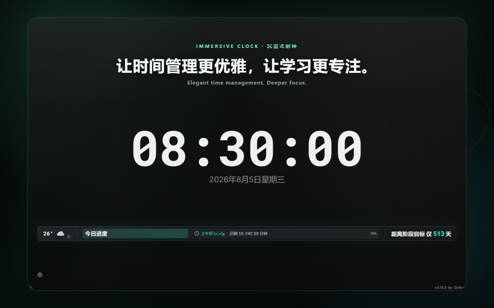
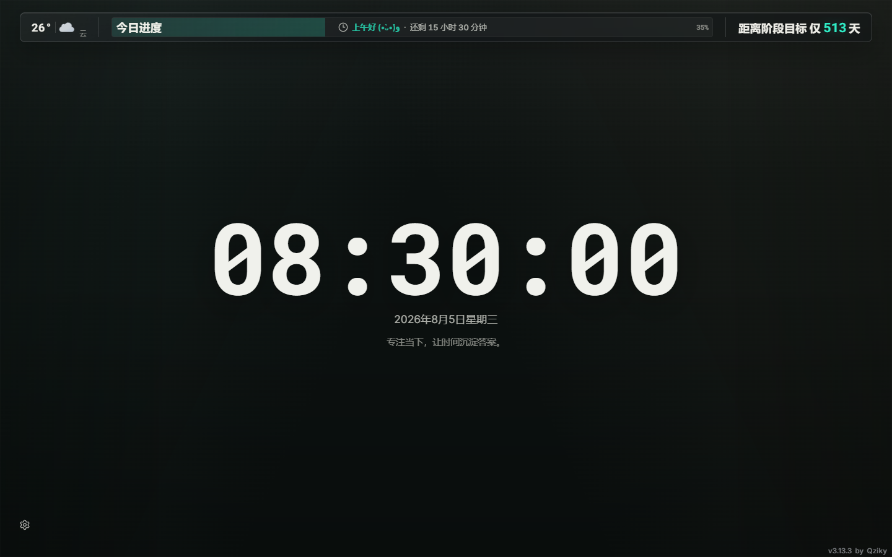
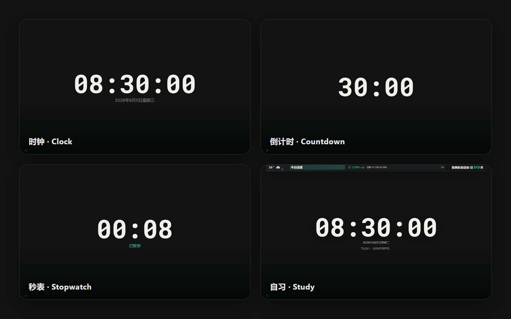
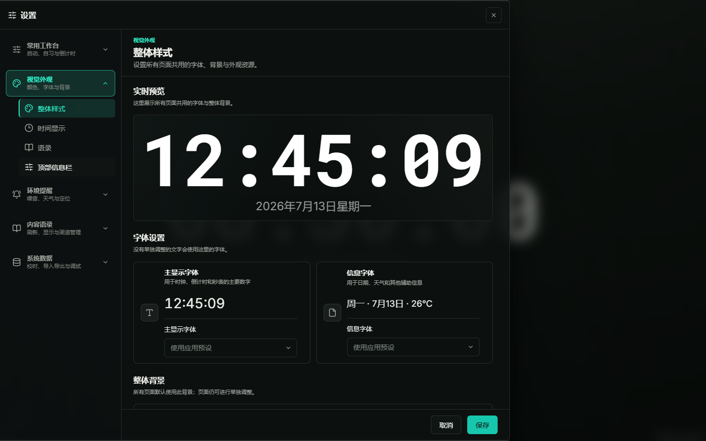

<h1>沉浸式时钟 · Immersive Clock</h1>

<strong>让时间管理更优雅，让学习更专注。</strong>

为教室、自习空间与个人专注打造的本地优先全屏时间看板。

  <a href="https://github.com/Qziky/Immersive-clock/releases/latest"><strong>下载 v4.0.1</strong></a>
  ·
  <a href="docs/user-guide/README.md"><strong>使用文档</strong></a>
  ·
  <a href="CONTRIBUTING.md"><strong>参与贡献</strong></a>

  
  
  

简体中文 · <a href="README.en-US.md">English</a>

## 一眼了解

沉浸式时钟将四种时间模式、自习信息、环境提示和外观定制组织在一个适合长时间展示的
低干扰界面中。

| 能力         | 适用场景               | 说明                                         |
| ------------ | ---------------------- | -------------------------------------------- |
| **时钟**     | 桌面、投屏、常驻显示   | 大字时间、日期、秒数开关与自动隐藏 HUD       |
| **倒计时**   | 考试、演讲、番茄钟     | 快捷时长、自定义时间与结束提醒               |
| **秒表**     | 活动、训练、课堂计时   | 开始、暂停、继续与归零                       |
| **自习**     | 教室、自习室、个人专注 | 时间、天气、进度、事件、语录与可选环境监测   |
| **本地优先** | 无账号的个人使用       | 设置、课表、资源和历史默认保存在当前设备     |
| **外观定制** | 投屏适配与个性化       | 字体、背景、时间显示和组件级样式             |
| **多平台**   | 浏览器、桌面与移动设备 | Web/PWA、Windows/Linux、正式签名 Android APK |

> 本地优先不等于所有功能完全离线。核心计时与本地内容可离线使用；新天气、城市搜索、在线
> 语录、外部校时和反馈页面需要网络。

## 界面预览 / Interface preview

以下画面使用演示数据，不包含真实位置、课程、姓名或麦克风数据。

### 自习看板 / Study dashboard

天气、今日进度、阶段目标、固定时间与原创演示语录集中在一条克制的信息层级中。

### 四种模式 / Four modes

同一套界面语言覆盖时钟、30 分钟倒计时、暂停后的非零秒表与自习模式。

### 外观设置 / Appearance settings

设置中心提供实时预览、主显示字体、信息字体、背景和各页面外观配置。

## 快速开始

### 使用 Web / PWA

1. 从 [GitHub Releases](https://github.com/Qziky/Immersive-clock/releases/latest) 下载
   `immersive-clock-web-4.0.1.zip`，部署到支持 HTTPS 和 SPA fallback 的 Web 服务。
2. 通过页面右下角 HUD 切换时钟、倒计时、秒表和自习模式。
3. 在支持的浏览器中选择“安装应用”或“添加到主屏幕”，即可作为 PWA 启动。

> 仓库外的在线站点不在 v4.0.1 发布范围内；本页不对其当前版本或可用性作保证。

### 安装版本

| 平台      | 获取方式                                                                    | 当前边界                             |
| --------- | --------------------------------------------------------------------------- | ------------------------------------ |
| Web / PWA | [GitHub Releases](https://github.com/Qziky/Immersive-clock/releases/latest) | 下载版本化 Web ZIP 后自托管          |
| Windows   | [GitHub Releases](https://github.com/Qziky/Immersive-clock/releases/latest) | x64 安装版与便携版，以发布附件为准   |
| Linux     | [GitHub Releases](https://github.com/Qziky/Immersive-clock/releases/latest) | AppImage、deb 与 rpm，以发布附件为准 |
| Android   | [GitHub Releases](https://github.com/Qziky/Immersive-clock/releases/latest) | 正式签名侧载 APK，不是应用商店分发包 |
| macOS     | 自托管 Web / PWA                                                            | 当前没有对外发布原生安装包           |

## 隐私与能力边界

- 核心时间功能无需账号；项目不提供自动云同步。
- 设置、课表、倒计时、语录、自定义字体与背景等数据默认保存在当前浏览器或客户端。
- 麦克风只在用户启用环境监测后请求；README 演示截图未采集或展示麦克风数据。
- 默认噪音指标是同一设备、相近条件下可比较的 **0–100 环境安静评分**，不是专业声级计。
- 估算 dB(A) 需要外部参考校准，仍不能用于执法、职业健康、设备验收或科学实验结论。
- 天气、在线语录、外部校时、反馈问卷和可选网站分析依赖相应第三方网络服务。
- 导出的备份为明文文件，可能包含位置、课程安排、语录或噪音活动时间，请妥善保管。

更多说明见[数据与隐私原则](docs/product/data-and-privacy-principles.md)和
[环境安静评分算法](docs/technical/modules/quietness-scoring.md)。

## 使用帮助

完整说明请查看[用户指南](docs/user-guide/README.md)，涵盖四种模式、设置、天气、噪音、备份与
常见问题。

### 详细操作与权限

- [快速开始](docs/user-guide/quick-start.md)
- [时间模式与 HUD](docs/user-guide/time-modes-and-hud.md)
- [自习模式与课程表](docs/user-guide/study-mode-and-schedule.md)
- [设置与个性化](docs/user-guide/settings-and-personalization.md)
- [天气、定位与提醒](docs/user-guide/weather-location-and-alerts.md)
- [噪音监测与报告](docs/user-guide/noise-monitoring-and-reports.md)
- [数据备份、隐私与重置](docs/user-guide/data-backup-privacy-and-reset.md)
- [安装、离线与更新](docs/user-guide/installation-offline-and-updates.md)

### 常见问题

- **离线时天气或在线语录不可用？** 这是预期行为；核心计时和本地内容仍可使用。
- **浏览器没有 PWA 安装按钮？** 检查 HTTPS、浏览器支持和是否已安装。
- **噪音监测没有数据？** 检查系统与浏览器麦克风权限，并在设置中启用环境监测。
- **macOS 有桌面安装包吗？** 当前没有，请使用 Web 版或安装为 PWA。
- **如何迁移设置？** 使用“系统数据”中的导出与导入，并保护好明文备份。

更多问题见[FAQ 与排障](docs/user-guide/faq-and-troubleshooting.md)。

## 贡献与反馈

- 代码、文档与翻译贡献请阅读 [CONTRIBUTING.md](CONTRIBUTING.md)。
- 功能建议与问题报告：[GitHub Issues](https://github.com/Qziky/Immersive-clock/issues)。
- QQ 交流群：[965931796](https://qm.qq.com/q/fawykipRhm)。
- 使用体验反馈：[腾讯问卷](https://wj.qq.com/s2/25666249/lj9p/)。

### 社区与 Star 历史

  

- 友情链接：[SECTL](https://sectl.top/) ·
  [阑山桌面](https://github.com/wwiinnddyy/LanMountainDesktop)。

  <a href="https://www.star-history.com/#Qziky/Immersive-clock&type=date&legend=top-left">
    <picture>
      <source
        media="(prefers-color-scheme: dark)"
        srcset="https://api.star-history.com/svg?repos=Qziky/Immersive-clock&type=date&theme=dark&legend=top-left"
      />
      <source
        media="(prefers-color-scheme: light)"
        srcset="https://api.star-history.com/svg?repos=Qziky/Immersive-clock&type=date&legend=top-left"
      />
      
    </picture>
  </a>

## 许可证

本项目采用 [GPL-3.0-only](LICENSE) 许可证。

Copyright © 2025–2026 [Qziky](https://github.com/Qziky)
