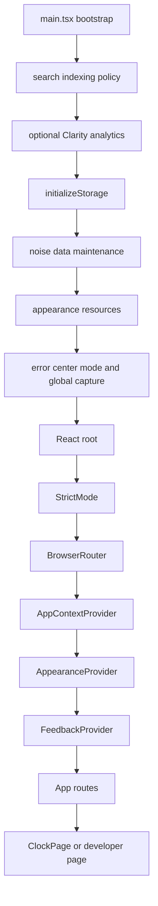

# 应用架构

Immersive Clock 是 React 19 + TypeScript + Vite 的单页应用。Web/PWA 和 Electron 共用
`src/` 渲染层；Electron 只在主进程、预加载脚本和协议层提供桌面能力。

## 启动链路

`src/main.tsx` 的 `bootstrap()` 是唯一的渲染入口。它先执行不依赖 React 的初始化，再创建
Provider 树和路由：



关键初始化行为：

1. `initializeStorage()` 创建或规范化版本化的 `AppSettings`，迁移旧课表、外观和语录字段，
   最后清理已知 legacy localStorage 键。
2. `initializeNoiseDataMaintenance()` 非阻塞恢复崩溃遗留会话、删除旧噪音键并调度历史重算；
   它不需要麦克风客户端已经启动。
3. `initializeAppearanceResources()` 负责外观资源目录的启动准备；二进制背景和字体本身仍在
   IndexedDB 中按资源 ID 管理。
4. PWA 注册在 `__ENABLE_PWA__` 为真时动态加载，仅 Web 构建执行；Electron 不注册 Service Worker。

## Provider 与页面编排

| 层级       | 实现                 | 责任                                                                                          |
| ---------- | -------------------- | --------------------------------------------------------------------------------------------- |
| Router     | `BrowserRouter`      | 将 `/`, `/clock`, `/countdown`, `/stopwatch`, `/study` 映射到主页面；开发者页按设置开关保护。 |
| App state  | `AppContextProvider` | 模式、HUD、倒计时、秒表、自习摘要、语录频道和弹窗状态。                                       |
| Appearance | `AppearanceProvider` | 已提交外观、草稿预览、场景背景、组件样式解析和资源加载。                                      |
| Feedback   | `FeedbackProvider`   | Toast、确认对话框和全局反馈队列。                                                             |
| Page       | `ClockPage`          | 根据模式渲染领域组件，启动时间同步/天气运行时，处理 HUD 自动隐藏和消息弹窗。                  |

`App` 只负责顶层路由、首次进入动画、公告显示时机和新手引导事件。`ClockPage` 不直接
读取网络或 IndexedDB；它通过服务快照和 Context 消费数据，将领域组件组合到主画布。

## 路由与模式

`src/utils/modeRoutes.ts` 维护模式和路径的双向映射：

| 模式        | 路径          | 主组件      |
| ----------- | ------------- | ----------- |
| `clock`     | `/`、`/clock` | `Clock`     |
| `countdown` | `/countdown`  | `Countdown` |
| `stopwatch` | `/stopwatch`  | `Stopwatch` |
| `study`     | `/study`      | `Study`     |

未知路径回退到 `ClockPage`。页面进入时根据 pathname 同步 `AppContext.mode`；通过 HUD 切换
模式时同时派发 reducer action 和导航，避免刷新后 URL 与内存状态分离。

开发者路由 `/design-system` 和 `/debug/audio` 需要 `general.developerModeEnabled`，关闭时
使用 `<Navigate to="/" replace />`。这些页面在生产环境通过 `X-Robots-Tag` 禁止索引。

## 主页面职责

`ClockPage` 是画布容器而不是业务服务层：

- 读取 `mode` 与外观解析结果，渲染 Clock、Countdown、Stopwatch 或 Study。
- 任意点击、Enter 或 Space 显示 HUD；非交互状态 8 秒后自动隐藏。引导、模态框和 HUD 内焦点
  会阻止自动隐藏。
- 挂载 `startTimeSyncManager()` 与 `startWeatherRuntime()`，卸载时停止监听器和定时器。
- 消费 `messagePopup:open/close` 自定义事件。自习模式响应全部业务消息，其他模式只显示天气
  预报与天气预警。
- 设置、公告、倒计时配置等浮层通过公共 UI 组件或 Portal 渲染，不修改页面级键盘默认行为。

## 分层约束

```text
pages -> components -> contexts/hooks -> services/utils -> types/constants
                    \-> ui (公共视觉原语)
electron main/preload -> browser capability bridge -> renderer services
```

- `src/components` 可以组合 `src/ui`，但不应复制公共按钮、输入框、弹层或图标实现。
- 网络、音频、持久化和算法副作用放在 `services/` 或 `utils/`；组件只编排输入、状态和视图。
- `src/types` 与 `src/constants` 提供跨模块契约；数据格式或模型版本变化要先更新类型和测试。
- Electron 主进程不能被渲染层直接导入；能力只能通过 `contextBridge` 暴露的窄 API 使用。

## 运行时错误边界

启动失败会被 `bootstrap().catch()` 捕获，记录到 `logger`，并把 loading screen 替换为可读错误。
业务服务失败通常更新自己的快照并向 `errorCenter` 报告；显示层是否弹窗由
`study.alerts.errorPopup` 和 `errorCenterMode` 决定。不要在组件中吞掉服务错误，也不要用
`console.log` 代替统一日志。
