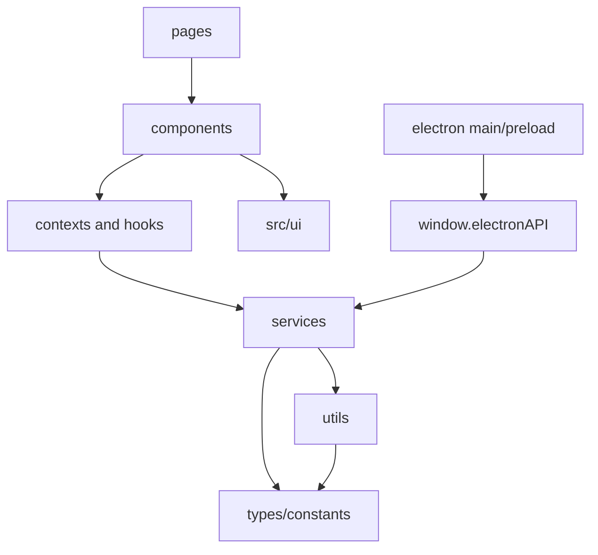

# 模块地图与边界

本页是代码导航。新增功能前先确认它属于哪个层级，再选择最窄的入口；不要因为组件能访问
某个 API 就把网络、存储和算法都写进组件。

## 目录职责

| 路径              | 责任                                            | 不应承担                 |
| ----------------- | ----------------------------------------------- | ------------------------ |
| `src/main.tsx`    | 启动初始化、Provider 根和 PWA 注册              | 领域渲染、具体请求       |
| `src/App.tsx`     | 路由、公告和引导生命周期                        | 计时、天气、噪音算法     |
| `src/pages/`      | 页面级编排与开发者页面                          | 可复用控件实现           |
| `src/components/` | 领域 UI、弹窗和业务组合                         | 通用按钮/输入/图标原语   |
| `src/ui/`         | 公共视觉组件、令牌、图标、Portal 和反馈基础设施 | 具体天气、课表或时钟业务 |
| `src/contexts/`   | Context 状态和 reducer                          | 直接发起长期网络任务     |
| `src/hooks/`      | 计时器、事件、音频、运行时订阅的复用行为        | 持久化协议定义           |
| `src/services/`   | 网络、天气、语录、噪音、数据管理等副作用边界    | 直接渲染 DOM             |
| `src/utils/`      | 设置、缓存、算法、迁移、格式化和纯逻辑          | 大型页面布局             |
| `src/types/`      | 跨模块 TypeScript 契约                          | 运行时副作用             |
| `src/constants/`  | 时间、噪音和报告等共享参数                      | 用户可变配置             |
| `electron/`       | 主进程、协议、IPC、NTP、权限策略                | 渲染层 UI 和业务状态     |
| `public/`         | 静态资源、manifest、运行时公告/更新日志         | 源码模块                 |
| `tests/e2e/`      | Playwright 关键用户流程和视觉基线               | 单元算法断言             |

## 领域模块索引

### 时间与自习

- 模式容器：`src/pages/ClockPage/ClockPage.tsx`。
- 时钟、倒计时、秒表：`src/components/Clock/`、`Countdown/`、`Stopwatch/`。
- 自习聚合：`src/components/Study/`、`StudyStatus/`。
- 时间源与校时：`src/utils/timeSource.ts`、`timeSync.ts`。
- 课表：`src/components/ScheduleSettings/`、`src/utils/studySchedule*.ts`。

详见 [Time and study](../modules/time-and-study.md)。

### 天气与定位

- 展示与设置：`src/components/Weather/`、`SettingsPanel/sections/Weather*.tsx`。
- 业务流程：`weatherService.ts`、`weatherRuntime.ts`、`locationService.ts`。
- 缓存与跨标签页：`weatherStorage.ts`、`weatherSyncChannel.ts`、`weatherCrossTabLock.ts`。
- 降水与预警：`minutelyWeatherRuntime.ts`、`weatherAlertRuntime.ts`、`weatherNotificationRuntime.ts`。

详见 [Weather and location](../modules/weather-and-location.md)。

### 噪音

- 展示：`NoiseMonitor/`、`NoiseSettings/`、`NoiseReportModal/`、`NoiseHistoryModal/`。
- 采集：`src/services/noise/noiseCapture.ts`、`noiseAudioWorklet.ts`、`noiseCaptureRuntime.ts`。
- 协调与持久化：`noiseCoordinator.ts`、`noiseFeatureRepository.ts`、`noiseFeatureArchiveService.ts`。
- 评分：`src/utils/noiseScoreEngine.ts`、`noiseRescoreCore.ts`、`noiseRescore.worker.ts`。

详见 [Noise capture and storage](../modules/noise-capture-and-storage.md) 和
[Quietness scoring](../modules/quietness-scoring.md)。

### 语录与公告

- 语录服务：`src/services/quotes/`，统一本地和远程提供商。
- 内容设置：`QuoteChannelManager/`、`MotivationalQuote/`。
- 公告：`AnnouncementModal/`、`utils/announcementStorage.ts`、`public/docs/*.md`。

详见 [Quotes, schedule and announcements](../modules/quotes-schedule-and-announcements.md)。

## 依赖方向

推荐依赖方向是单向的。`services` 可以依赖 `utils` 和 `types`，但 `utils` 不应反向导入页面；
领域组件只在确有复用时使用服务的公开快照，不直接实例化 IndexedDB 或请求客户端。

## 新功能落点决策

1. 先找现有公共组件和服务；复用现有契约比增加新入口优先。
2. 仅页面布局和领域呈现放 `src/components`；跨页面控件放 `src/ui`。
3. 需要跨刷新保存的字段扩展 `AppSettings` 并增加规范化/迁移测试。
4. 有异步、定时、跨标签页或权限副作用时放在 `services`，组件通过订阅消费。
5. 模型参数、协议版本和 Store 名称属于公共技术契约，必须同步文档、类型和测试。
