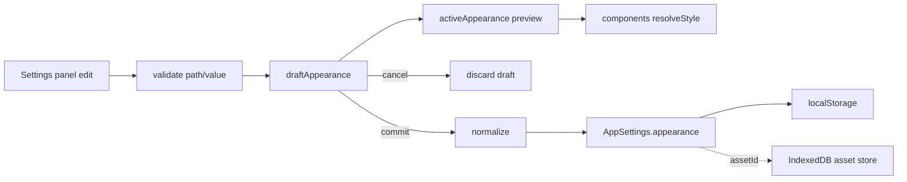
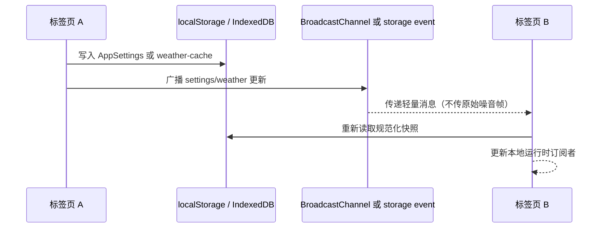

# 状态与数据流

应用将“需要即时重渲染的 UI 状态”和“需要跨会话保存的配置/数据”分开。React Context
解决页面内状态组合；服务快照解决高频、跨标签页或异步领域运行时；持久化由专用边界统一处理。

## AppContext

`src/contexts/AppContext.tsx` 使用 `useReducer`，初始值从 `getAppSettings()` 派生：

```text
AppState
├─ mode: clock | countdown | stopwatch | study
├─ isHudVisible / isModalOpen
├─ countdown: initialTime, currentTime, isActive, endTimestamp
├─ stopwatch: elapsedTime, isActive
├─ timeDisplay: clock/study seconds visibility
├─ study: target, countdowns, display, info carousel, alerts
├─ quoteChannels: resolved built-in + custom channels
├─ quoteSettings: refresh and animation preferences
└─ announcement: modal-only tab and visibility state
```

reducer 只返回新状态；需要持久化的 action 在分支内调用 `updateGeneralSettings`、
`updateStudySettings` 或 `updateAppSettings`。这意味着 Context 是当前页面的投影，不是第二套
独立数据库。刷新后必须能从 `AppSettings` 重新构造等价状态。

### 高频计时为何不全局 tick

- 倒计时用 `endTimestamp` 作为绝对锚点，组件以 100ms `requestAnimationFrame` 频率刷新显示，
  暂停时重新计算剩余秒数，再一次性派发 `PAUSE_COUNTDOWN`。
- 秒表使用 `useAccumulatingTimer`，默认 10ms tick 在页面休眠后按累计次数补偿，避免每一帧
  都触发全树渲染。
- 时钟和自习页分别按 1 秒读取校时后的 `Date`；天气、噪音和语录各自使用运行时订阅。

## 外观状态

`AppearanceProvider` 保留三种视图：

1. `committedAppearance`：最近一次保存、已规范化的 `AppearanceSettingsV2`。
2. `draftAppearance`：设置页编辑期间的深拷贝；存在时驱动实时预览。
3. `activeAppearance`：草稿优先，否则使用已提交配置。

样式解析按全局、场景、组件、slot、状态和实例逐层合并。背景资源不直接写入配置；配置只
保存 `assetId`，数据 URL 由 `appearanceAssets` 从 IndexedDB 读取。取消预览丢弃草稿，提交
时一次性 `replaceAppearanceSettings(normalizeAppearance(...))`。



## 服务快照与事件

以下运行时状态不适合塞入全局 reducer：

- `weatherRuntime`：天气完整数据、分钟级降水、刷新状态和错误。
- `minutelyWeatherRuntime` / `weatherAlertRuntime`：从缓存派生的阶段、预警和新鲜度。
- `noiseStreamService`：Leader/Follower 角色、实时环形缓冲、评分进度、校准状态。
- `QuoteService`：提供商健康状态、请求去重和缓存。
- `timeSync`：有效时间偏移、最近 RTT、自动校时定时器。

这些服务通过 `subscribeXxx` 返回取消函数，组件在 `useEffect` 中订阅并在卸载时清理。设置
保存会发出 `settingsSaved` 或细分的 `SETTINGS_EVENTS`；天气监听到设置变化后强制重新定位和刷新。

## 跨标签页数据流



天气缓存同步同时使用 `BroadcastChannel` 和 localStorage storage event，消息带 ID 去重。
噪音采集不广播 PCM 或 TypedArray，只广播约 250ms 合并后的展示快照；原始特征只由 Leader
写入 IndexedDB。设置更新依赖浏览器 storage event，应用内则使用 `settingsEvents` 让同标签页
立即重读。

## 消息弹窗与公告

领域服务通过 `CustomEvent("messagePopup:open")` 发布消息，`ClockPage` 按当前模式过滤并
转成 Feedback Toast。公告弹窗的内容从 `public/docs/announcement.md`、`public/docs/changelog.md`
按 `BASE_URL` 运行时获取；“一周内不再显示”只写入 `AppSettings.general.announcement`。

## 数据流不变量

- 设置更新必须经过 `appSettings.ts` 的规范化和版本写入，不新增散落的设置键。
- 服务快照可以丢失并重建；用户内容、外观资源和噪音历史不能依赖 React 内存。
- 跨窗口锁失效时宁可退化为只读/离线，也不能同时产生两个噪音 Leader 或重复天气请求。
- UI 不猜测服务错误含义：使用 `status`、`signalHealth`、`freshness` 等显式字段呈现状态。
