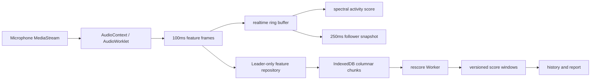

# 噪音采集与存储

噪音系统严格分离“采集事实”和“派生评分”。PCM 只存在于 AudioWorklet 当前处理窗口；应用
持久化的是每 100ms 的紧凑特征，不持久化、不广播、不导出原始音频。

## 总体链路

关闭“保存监测数据”时，C→D→E 仍工作，但不会创建会话、写原始特征或派生历史。

## 采集适配器

`BrowserAudioWorkletCaptureAdapter` 请求麦克风时尽量关闭系统音频处理，创建 AudioContext 并加载
`noiseAudioWorklet.ts`。多声道以算术平均混合为单声道。设备信息被转换为匿名 `deviceKey`、
sample rate、channel count、处理签名和处理是否真的关闭。

轨道 muted/ended 或 AudioContext suspended 会终止当前会话并触发重新选举/重试。用户首选设备
保存在 `noiseControl.preferredInputDevice`；设备消失时允许回退默认输入，但需要在诊断中显示。

## 100ms 特征协议

`NoiseFeatureExtractor` 对当前采样率创建 A-weighting 滤波器，并以 100ms 窗口输出：

| 字段            | 含义                            |
| --------------- | ------------------------------- |
| `frameSequence` | 会话内从 1 开始的递增序列       |
| `startSample`   | 会话采样轴上的窗口起点          |
| `rmsDbfs`       | 原始信号 RMS dBFS               |
| `aWeightedDbfs` | A 加权 RMS dBFS                 |
| `sampleP01Dbfs` | 窗口绝对振幅 P1 对应 dBFS       |
| `zeroRatio`     | 绝对值不高于 `1e-7` 的样本比例  |
| `clippedRatio`  | 绝对值不低于 `0.999` 的样本比例 |

主线程在帧外包裹 `leaderEpoch` 和 `captureSessionId`。逐帧不重复保存时间戳、采样率或窗口长度；
时间统一由 `session.startedAt + startSample / sampleRate` 恢复。

## 会话协议

`NoiseCaptureSession` 保存：schema、extractor 版本、Leader 任期、会话/生产者 ID、开始结束时间和
原因、实际 sample rate、frame samples、匿名设备键、声道/混合方式、系统处理状态和最后序列位置。

设备、Leader 或轨道状态变化都会结束会话；评分窗口不得跨不兼容会话拼接。启动时
`recoverAbandonedNoiseCaptureSessions()` 把崩溃遗留会话标记为 `recovered-after-crash` 并封存分块。

## 多标签页单写入者

`NoiseCoordinator` 优先申请独占 Web Lock `immersive-clock:noise-capture:v2`；不支持 Web Locks 时，
使用 TTL 4 秒、1 秒心跳的 localStorage lease。角色为 `leader | follower | none`：

- Leader 创建麦克风、会话和 IndexedDB 写入器；
- Follower 不访问麦克风，只消费合并后的展示快照；
- Leader 释放时先停止 runtime、检查点并封存会话，再释放领导权；
- 新 Leader 使用新的 epoch 和会话，不能续写旧会话。

## 列式持久化

`noise-feature-chunks` 以会话和一分钟采样区间分块：

- `sequenceOffsets`、`startSampleOffsets` 使用 `Uint32Array`；
- 五个特征列使用 `Float32Array`；
- 基值放在 `firstFrameSequence`、`firstStartSample`；
- 活跃分块每 5 秒检查点，跨分钟或结束时 `sealed: true`。

会话和分块跨 Store 事务写入，崩溃时最多丢失约 5 秒尚未检查点的数据。IndexedDB 失败会把
`persistence.available` 标为 false，实时评分不停止，也不会退回 localStorage。

## 实时缓冲与历史窗口

内存环形缓冲保留最近 60 秒、容量约 616 个点。首次评分等待完整 60 秒，此后每 5 秒生成一个
`NoiseScoreWindow`；当前模型、源帧范围、覆盖率、质量、信号健康和可选估算 dB(A) 都随记录保存。

原始会话、特征分块和派生评分统一保留 14 天。清理噪音历史会同时删除三类数据和重算状态，
但保留噪音设置以及独立设备校准。

## 后台重算

`scheduleNoiseRescore()` 按会话开始时间倒序重放已封存会话：

1. 读取当前模型 `spectral-activity-v2` 和配置摘要；
2. 检查完成集合和是否缺失应有评分；
3. Worker 逐会话读取特征并构建窗口；无 Worker 时在主线程分片让出事件循环；
4. 在噪音历史写锁内幂等写入；
5. 保存 session/chunk checkpoint、完成数和错误；
6. 完成后删除非当前模型派生评分。

重算可暂停、续跑和 reset。实时路径与重算路径共享 `computeSpectralActivityScore()`，算法详情见
[Quietness scoring](quietness-scoring.md)。

## .icnoise 原始特征归档

`.icnoise` v1 的 magic 为 `ICNOISE1`，文件由 JSON header 和列式二进制 payload 组成：

- 包含会话元数据和已封存分块；
- 明确 `pcmIncluded: false`；
- 支持按日期范围导出；
- 导入先校验格式、分块长度、引用、ID 冲突和新增 quota；
- 同 ID 同内容可幂等导入，同 ID 不同内容整次拒绝；
- 预检和事务写入分离，成功后自动调度重算。

常规 JSON 备份只包含当前模型的派生评分，不包含 `.icnoise` 原始特征；两个格式不能互相替代。

## dB(A) 校准

校准采集 10 秒，需要用户输入 30–120 dB(A) 的外部参考值，且浏览器必须确认系统音频处理已
关闭。校准只保存 `offsetDb = referenceDbA - measuredDbfsA` 和设备/处理签名。设备或处理签名
不匹配时不得复用。

校准用于显示 `aWeightedDbfs + offsetDb` 的估算 dB(A)，不参与安静评分。没有可信校准时只显示
相对特征或安静分数，不能假装成专业声级计。

## 观测与失败状态

运行时快照包含角色、状态、signal health、confidence、评分进度、最新特征、持久化可用性、
pending frame 数和校准状态。常见状态：permission denied、track muted/ended、AudioContext
suspended、insufficient coverage、signal anomaly。UI 应呈现原因和恢复入口，不应把所有错误都
显示为“环境太安静”。
