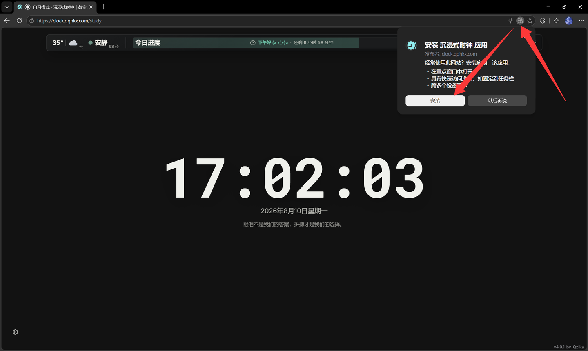
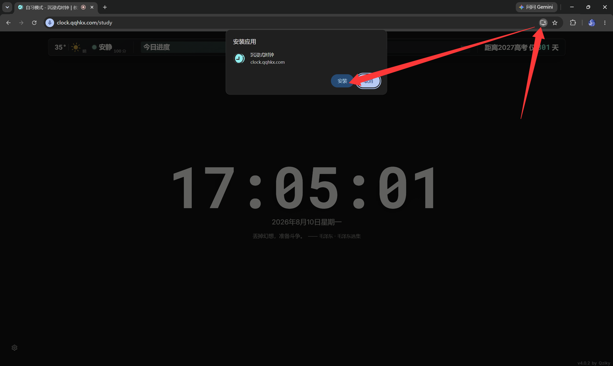

# 安装、离线与更新

## 使用 Web / PWA 构建

直接打开[沉浸式时钟在线版](https://clock.qqhkx.com)即可使用 Web/PWA，默认安装流程不需要下载或部署 Web ZIP。
如果要自行托管，再从 [GitHub Releases](https://github.com/Qziky/Immersive-clock/releases) 下载版本化 Web ZIP，
并部署到支持 HTTPS、SPA fallback 和天气同源代理的 Web 服务。仓库外的在线站点不属于 GitHub Release
的发布或验收范围，请勿仅凭站点内容判断当前仓库版本。

位置和麦克风通常要求安全连接；如果浏览器提示当前页面不安全，相关权限可能不可用。建议使用官方 HTTPS 地址或可信的自托管环境。

## 安装为 PWA

PWA 会把网页版安装到桌面、开始菜单或主屏幕，打开时更像独立应用。

### Windows 或 Linux 的 Edge

1. 打开[沉浸式时钟在线版](https://clock.qqhkx.com)并等待页面完成加载。
2. 点击地址栏右侧的安装图标。
3. 在“安装 沉浸式时钟 应用”弹窗中点击“安装”。

### Windows 或 Linux 的 Chrome

1. 打开[沉浸式时钟在线版](https://clock.qqhkx.com)并等待页面完成加载。
2. 点击地址栏右侧的安装图标。
3. 在“安装应用”对话框中点击“安装”。

### Android Chrome

打开浏览器菜单，选择“安装应用”或“添加到主屏幕”。不同系统名称可能略有差异。

### iPhone / iPad Safari

点击“分享”，选择“添加到主屏幕”，再确认名称和图标。

如果没有安装入口，请检查：

- 是否使用 HTTPS；
- 页面是否已经完整加载；
- 浏览器是否支持 PWA 安装；
- 是否已经安装过；
- 当前是否处于隐私/无痕模式或受组织策略限制。

## 桌面客户端

Windows 和 Linux 可从项目的 [GitHub Releases](https://github.com/Qziky/Immersive-clock/releases) 下载构建产物。

- Windows 提供 x64 安装版和便携版。
- Linux 构建目标包括 AppImage、deb 和 rpm，实际提供哪些文件以对应版本的 Release 为准。
- Android 提供正式签名侧载 APK。仅从 GitHub Release 下载；系统可能要求允许“安装未知应用”。
- 当前没有对外发布的 macOS 安装包；macOS 用户可自托管 Web/PWA 构建。

桌面客户端和浏览器/PWA 的本地数据彼此独立，不会自动同步。第一次启动桌面版时，需要重新设置并重新授权麦克风或位置，或通过 JSON 备份迁移。

## 离线时能用什么

网页/PWA 在首次成功联网加载后会缓存核心页面和静态资源。离线时通常仍可使用：

- 时钟；
- 倒计时；
- 秒表；
- 自习页面布局；
- 已保存的课程表、事件和本地语录；
- 已经缓存在设备上的字体、背景和部分内容。

离线时不能保证：

- 获取新天气、城市搜索、天气预警或分钟降水；
- 获取新的在线语录；
- 使用 HTTP Date、时间 API 等网络校时来源；
- 打开尚未缓存的公告、更新日志或外部反馈页面。

应用可能继续显示最近一次缓存的天气或在线内容，但会标记过期或停止给出确定倒计时。离线数据不等于最新数据。

## 更新网页版和 PWA

Web/PWA 会在启动时后台检查稳定版；回到前台且距上次检查超过 6 小时时再次检查。浏览器发现新的
Service Worker 后会直接切换到新资源并刷新当前页面，不再显示手动更新按钮。多次更新事件会合并为
一次切换，避免重复刷新。

可以打开“设置 → 系统数据 → 应用更新”查看当前/最新版本、上次检查时间和状态。“自动检查更新”
默认开启，可在设置草稿中关闭后保存；该页面不再提供手动检查或安装操作。浏览器已经发现的新
Service Worker 仍会直接应用，以避免继续运行失效的旧资源。

如果看起来仍是旧版本：

1. 关闭所有沉浸式时钟标签页和 PWA 窗口。
2. 重新打开并保持联网。
3. 仍未更新时，到“设置 → 系统数据 → 设置数据”清理临时缓存，然后重新加载。
4. 最后才考虑在浏览器中清除该站点数据；这会同时删除本地设置和资源，务必先备份。

点击主界面右下角版本号仍用于查看公告和更新日志，不替代“应用更新”状态面板。

## 更新桌面客户端

Windows NSIS 安装版和 Linux AppImage 会检查稳定版并在后台静默下载。下载完成后只会提示“新版本
已下载，请重启应用”；应用正常退出时会自动安装已下载版本，不再提供手动安装按钮。Windows
便携版与 Linux deb/rpm 不会自替换，更新提醒仍会提供对应下载地址或 GitHub Release 页面。

若自动下载失败，可在“设置 → 系统数据 → 应用更新”查看错误，恢复网络后重启应用以重新检查。
生产自动更新是否能被系统无警告接受，仍取决于该版本的代码签名状态。

升级前建议创建完整 JSON 备份。Windows 安装器默认不会因为普通卸载就主动删除应用数据，但不要把它当作备份机制；清理系统、变更账户或手动删除数据目录仍可能造成丢失。

## 更新 Android 客户端

Android 会检查稳定版清单。发现新版本后，右下角提醒中的“下载更新”会打开 APK 下载地址；无法
打开时回退到 GitHub Release 页面。下载后仍需由 Android 系统确认覆盖安装。

后续正式版本会继续使用同一发布证书；如果
设备上安装的是签名不同的 Debug APK，通常需要先卸载，卸载前务必导出完整备份。Android 客户端
与浏览器、桌面客户端的数据彼此独立，不会自动同步。

## 卸载与数据

- 卸载 PWA 不一定会删除浏览器中的站点数据；是否保留取决于浏览器。
- 清除浏览器站点数据会删除设置、自定义资源和历史。
- 删除桌面应用文件不等于可靠清理用户数据；如需在共享设备上彻底清除，请先在“系统数据 → 设置数据”执行“删除全部本地数据”，再卸载应用。

迁移和备份方法见[数据备份、隐私与重置](data-backup-privacy-and-reset.md)。
